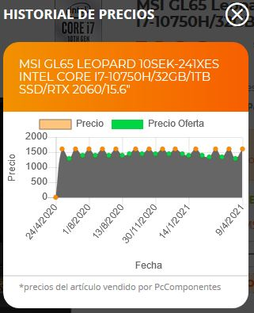

# PC_Builder

Price tracker of the desired parts of a tower PC

## Apartat 1
Els preus de les peces electròniques varien molt de preu últimament i és difícil enganxar el millor moment per comprar.
La falta de semiconductors i la criptomineria ha fet augmentar notablement el preu dels components electrònics especialment les targetes gràfiques fins al punt de fer-les desproporcionadament cares per al consumidor mitjà.

L'objectiu és programar un rastrejador de preus per poder veure el moment més barat per comprar.

S'utilitzarà la web de www.pccomponentes.com

## Apartat 2
El dataset es dirà PC_parts_price.csv

## Apartat 3
Aquest dataset tindrà un històric dels preus de les diferents peces que s'estan monitoritzant per tenir una idea de quant podran baixar de preu les parts que ens interessen. 
Per no saturar la pàgina web de www.pccomponentes.com es farà un Query un cop cada hora.

## Apartat 5
El dataset PC_parts_price.csv Inclourà:
- Part: El nom de la peça que es vol comprar (placa base, RAM, font d'alimentació...)
- Price: Preu de la peça desitjada
- Available: Disponibilitat (Y / N)
- Date: Data adquisició de la dada de preu i disponibilitat

**Falta dir com es recolliran les dades**

## Apartat 6

Agraïments: El propietari de les dades és www.pccomponentes.com

És un referent a nivell espanyol de components d'electrònica i té uns preus molts competitius.

La pròpia web de pccomponentes.com ja incorpora un històric de preus però és interessant a nivell acadèmic programar-ho.

Exemple de pccomponentes:

**Posar algo de tot l'anàlisis de robots i tal**

## Apartat 7

**Inspiració**: Cada vegada que ens volem comprar un nou producte aquest fluctua molt de preu segons sigui l'època de l'any. 
Per exemple: L'Època del black friday és la pijtor època ja que és quan els preus estan més cars. Aquest punt el sé per experiència però amb aquesta automatització permetrà veure en quines èpoques de l'any hi ha el millor preu o les millors ofertes. 

## Apartat 8

**Llicència**: S'ha agafat la llicència **Released Under CC0: Public Domain License**

El motiu és que aquesta llicència no té cap tipus de restricció o obligació per la persona que li pugui interessar les dades contingudes en aquest github.
Si fos un projecte més professional es podria pensar en alguna altra més restrictiva que només permetès l'ús no professional o que obligués a nombrar o reconeixer d'on s'han tret la base de la programació.

